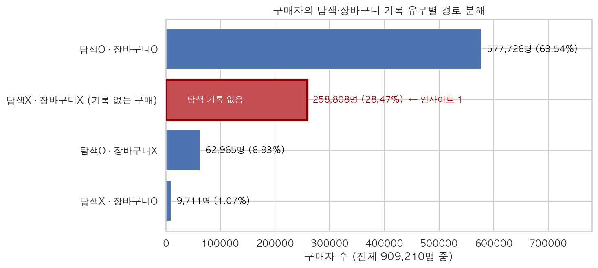
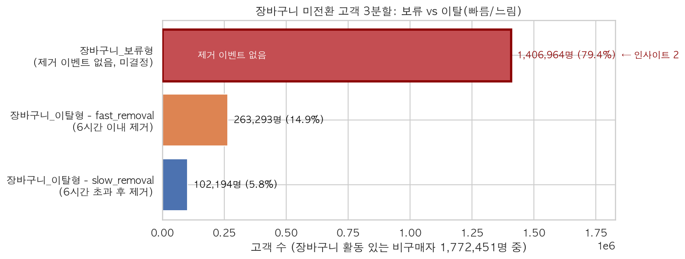
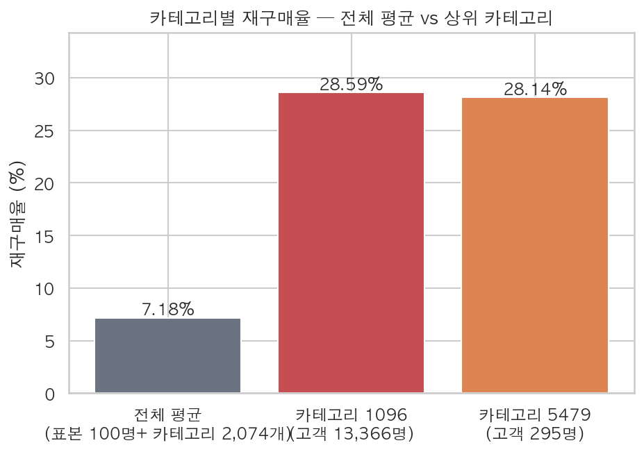
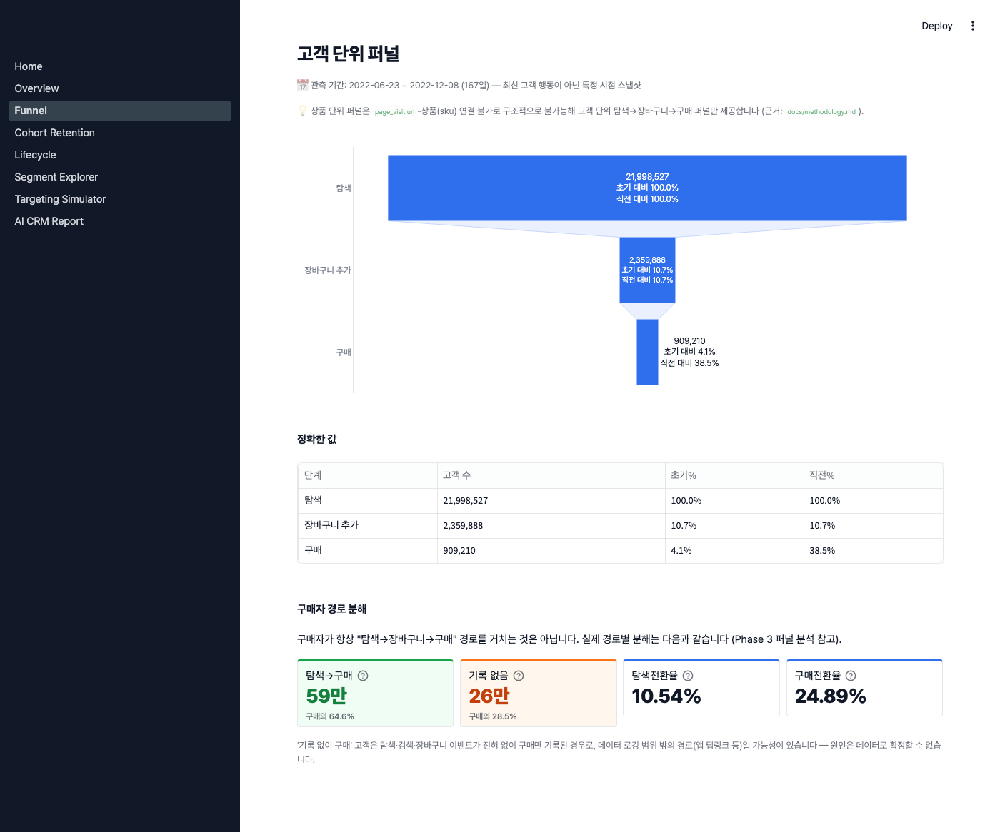
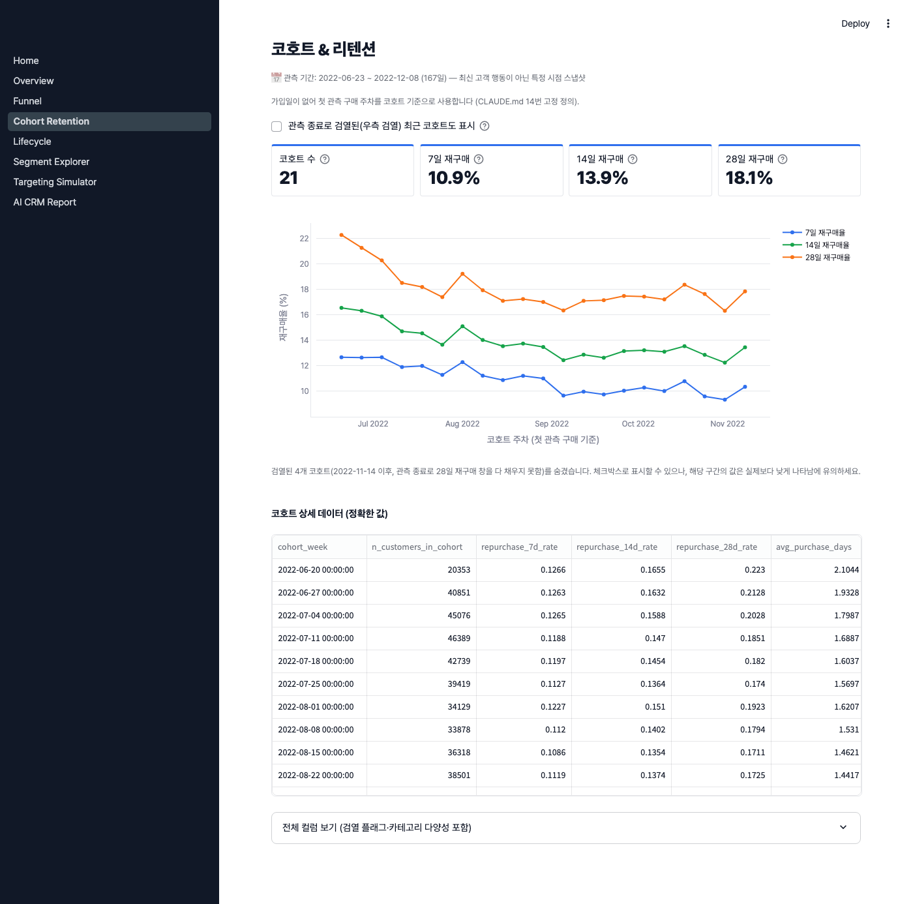
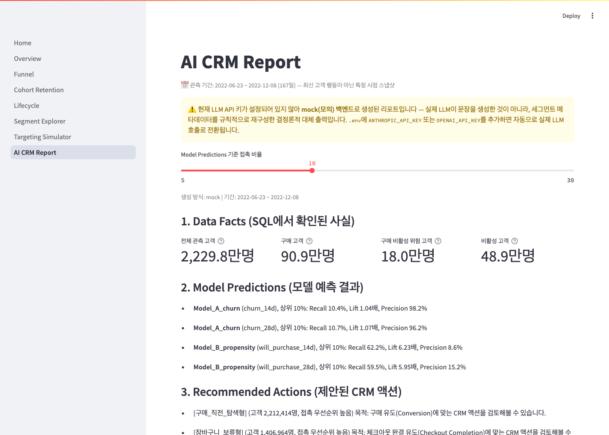

# 이커머스 고객 행동 퍼널 분석 및 CRM 타기팅 전략 설계

2.25억 건의 고객 행동 로그를 활용한 퍼널·라이프사이클·세그먼트 분석과
CRM 실험 설계 프로젝트

**30초 요약**

- **문제**: 고객마다 탐색·장바구니·구매 경로가 다른데 동일한 CRM 타기팅이 적절한가?
- **한 것**: 실제 이커머스 행동 로그를 SQL/Python으로 통합해 퍼널·라이프사이클·세그먼트를 분석하고 구매/비활성 타기팅 정책을 비교
- **핵심 발견**: 단일 퍼널 가정이 맞지 않았고(구매자의 35%+ 비표준 경로), 같은 장바구니 미구매도 세부 행동에 따라 다른 그룹이었으며, 높은 모델 성능이 항상 높은 CRM 운영 효율을 의미하지 않았다
- **결과**: 구매성향 모델은 동일 Recall 기준 접촉 인원을 21.68\~50.87% 줄일 가능성을 확인했지만, 비활성 모델은 약 1% 수준에 그쳐 단순 규칙이 더 실용적일 수 있다고 판단


**구현한 것**

- SQL 기반 고객행동 데이터마트
- Funnel / Retention / Lifecycle 분석
- 9개 CRM 세그먼트 설계
- 구매 비활성/구매성향 예측 모델(LightGBM)
- 타기팅 정책 시뮬레이션
- Streamlit 대시보드(7페이지)
- A/B 테스트 배정·검증 프레임워크(`src/experiments/`)

**아직 검증되지 않은 것**

- 실제 CRM 메시지 발송
- 실제 Treatment-Control 성과 측정
- Incremental conversion/revenue
- 실제 서비스 환경에서의 장기 효과

---

> 📅 **데이터 시점**: 2022-06-23 \~ 2022-12-08 (6개월 스냅샷). 최신 고객 행동이 아니라
> 2022년 하반기 특정 시점의 이커머스 행동 패턴 분석이다. 실제 CRM 캠페인을 집행한
> 적은 없으며, **과거 데이터로 대상 선정 효율을 검증한 방법론 시연**이다.

모든 고객에게 똑같은 CRM 메시지를 보내는 게 맞을까? 고객의 탐색·장바구니·구매
행동을 보면 답이 달라진다. **예전엔 샀지만 요즘 안 사는 고객**과 **아직 안
샀지만 살 것 같은 고객**은 다르다. 이 둘을 구분해서 누구를 먼저 챙길지
우선순위를 정하는 분석 시스템이다.

---

## 목차

1. [개요](#1-개요)
2. [가설](#2-가설)
3. [EDA](#3-eda)
4. [인사이트](#4-인사이트)
5. [액션 제안](#5-액션-제안)
6. [산출물](#6-산출물)
7. [한계](#7-한계)
8. [판단이 바뀐 순간](#8-판단이-바뀐-순간)
9. [향후 확장](#9-향후-확장)

---

## 1. 개요

### 프로젝트명

**Predicting Churn & Purchase Intent for CRM Targeting**

### 목적

실제 이커머스 고객의 검색·방문·장바구니·구매 행동을 통합해 고객 라이프사이클을
분석하고, 제한된 CRM 접촉 자원 안에서 다음 고객을 우선 선정할 수 있는 분석
시스템을 구축한다.

- 재활성화가 필요한 고객 (구매 비활성 위험)
- 구매 유도가 필요한 고객 (향후 구매 가능성)
- 장바구니 이탈/보류 고객
- 반복구매 가능성이 높은 고객
- 접촉 우선순위가 낮은 고객(과접촉 방지)

핵심 질문은 하나다.

> 단순 규칙(최근성 등)이나 무작위 타기팅보다, 구매 비활성 위험 고객과 향후
> 구매 고객을 더 효율적으로 선별할 수 있는가?

### 데이터 출처

- **데이터셋**: Synerise RecSys Challenge 2025 원본 데이터 (실제 온라인
  리테일 서비스의 익명화 고객 행동 로그)
- **공식 출처**: https://recsys.synerise.com/data-set
- **라이선스**: CC BY-NC 4.0 (© 2025 Synerise SA) — 원문: *"Universal
  Behavioral Modeling Dataset © 2025 by Synerise SA is licensed under
  Creative Commons Attribution-NonCommercial 4.0 International."*
- **테이블**: `product_buy`, `add_to_cart`, `remove_from_cart`, `page_visit`,
  `search_query`, `product_properties`
- **규모**: 고객 22,298,361명, 행동 이벤트 225,224,262건(구매 2,318,502건 포함)
  — 구매 경험이 있는 고유 고객은 909,210명. product_properties(상품 속성
  참조 테이블) 1,534,050행은 이벤트가 아니므로 제외.
- 원본 데이터는 라이선스상 이 저장소에 포함되지 않는다. 확보 절차는
  [`reports/phase1_download_log.md`](reports/phase1_download_log.md) 참고.

### 전체 파이프라인

```
원본 Parquet (6개 테이블)
  → SQL staging (VIEW, 6개)
  → SQL intermediate (TABLE, 6개)
  → SQL mart (TABLE, 11개)
  → Feature/Label (mart_customer_snapshot)
  → 모델링 (LightGBM, Model A/B)
  → 타기팅 시뮬레이션 (mart_targeting_simulation)
  → Streamlit 대시보드 (7 페이지) / LLM CRM 리포트
```

상세 데이터 계보: [`docs/erd.md`](docs/erd.md) · 컬럼/Grain/PK 정의:
[`docs/data_dictionary.md`](docs/data_dictionary.md)

---

## 2. 가설

분석에 들어가기 전, 이 프로젝트가 원래 던졌던 질문(핵심 질문 15개, 고객 이해
6 + CRM 타기팅 5 + 실무 활용 4)을 검증 가능한 가설 6개로 재구성했다. 각 가설의
검증 결과는 3\~6절에서 다룬다.

| # | 가설 | 검증 위치 | 결과 요약 |
|---|---|---|---|
| H1 | 고객 대부분은 "탐색 → 장바구니 → 구매"라는 단일 경로를 따를 것이다 | 3절 EDA(퍼널) | **부분 기각** — 구매자의 28.46%는 탐색·장바구니 기록 자체가 없다 |
| H2 | 첫 구매 이후 재구매는 예측 가능한 수준으로 누적될 것이다 | 3절 EDA(코호트) | 확인 — 7일 10.90%→28일 18.07%로 완만하게 누적, 코호트 간 변동은 크지 않음 |
| H3 | 고객은 구매 recency 기반으로 뚜렷이 구분되는 라이프사이클 상태를 가질 것이다 | 3\~4절 EDA/인사이트 | 확인 — 데이터 기반 임계값(14/28/60일)으로 8개 상태 분류, 미분류 0건 |
| H4 | 구매 비활성(재활성화 대상) 예측에서 모델이 단순 규칙보다 효율적일 것이다 | 4\~5절 인사이트/액션 제안 | **부분 확인** — 통계적으로는 우수(AUC 0.754 vs 0.669)하나, 실무 접촉 절감 효과는 1% 내외로 작음 |
| H5 | 향후 구매 가능성(구매 유도 대상) 예측에서 모델이 단순 규칙보다 효율적일 것이다 | 4\~5절 인사이트/액션 제안 | 확인 — AUC 0.865 vs 0.804, 동일 포착률 기준 접촉 인원 최대 50.87% 절감 |
| H6 | SQL 집계 결과를 LLM이 사실 왜곡 없이 설명하고, 대시보드로 접촉 우선순위를 실행 가능한 형태로 제공할 수 있을 것이다 | 6절 산출물 | 확인 — Data Facts/Model Predictions는 Python 값을 그대로 통과시키고, 금지 표현 검출 시 리포트 생성을 예외로 중단하는 안전장치로 구조적으로 보장 |

---

## 3. EDA

집계 대상: `mart_customer_360` (22,298,361명). 상품 페이지와 `sku`가 연결되지
않아(`page_visit.url`이 익명 숫자 ID) **상품 단위 분석은 구조적으로 불가능**하고,
아래는 전부 **고객 단위** 분석이다.

### 퍼널

```
탐색(Explore) → 장바구니 추가(Cart) → 구매(Buy)
```

| 단계 | 고객 수 | 전체 대비 | 직전 단계 대비 전환율 |
|---|---:|---:|---:|
| 전체 고객 | 22,298,361 | 100.00% | — |
| 탐색 | 21,998,527 | 98.66% | — |
| 장바구니 추가\* | 2,318,862 | 10.40% | 10.54% |
| 구매(표준 경로 완주) | 577,726 | 2.59% | 24.91% (장바구니 대비) |

\* 탐색 기록을 동반한 장바구니 활동만 집계. 탐색 기록 없이 장바구니 활동만
있는 고객 41,026명은 제외(순차 전환율 계산을 위해 탐색을 선행 조건으로 둠).

전체 구매자는 909,210명이며, 이 중 63.54%(577,726명)만 탐색→장바구니→구매
표준 경로를 완주했다. 나머지 36.46%는 아래 경로 분해 표 참고.


**H1 검증**: 퍼널을 단일 경로로 가정하면 안 된다 — 실제 구매자(909,210명)의
경로를 분해하면 **28.46%(258,808명)는 탐색·장바구니 기록이 전혀 없이 구매만
기록**돼 있다. "장바구니 없이 탐색만 하고 구매"(6.93%)까지 더하면 구매자의
35% 이상이 표준 경로를 거치지 않는다.

| 탐색 | 장바구니 | 구매 여부 | 고객 수 | 구매자 대비 |
|---|---|---|---:|---:|
| O | O | 구매 | 577,726 | 63.53% |
| O | X | 구매 | 62,965 | 6.93% |
| X | O | 구매 | 9,711 | 1.07% |
| X | X | 구매 | **258,808** | **28.46%** |

### 코호트 · 리텐션

가입일이 없어 **첫 관측 구매 주차**를 코호트 기준으로 쓴다. 909,210명이
25개 주차 코호트(2022-06-20 \~ 2022-12-05)로 분포한다.

| 지표 | 평균 (검열 안 된 코호트만) |
|---|---:|
| 7일 재구매율 | 10.90% |
| 14일 재구매율 | 13.88% |
| 28일 재구매율 | 18.07% (코호트별 범위 16.32%\~22.30%) |


마지막 4개 코호트(2022-11-14 이후)는 관측 종료로 인해 재구매율이 실제보다
낮게 나타나(우측 검열) 위 평균에서 제외했다 — 그대로 포함하면 "최근 코호트일수록
재구매율이 떨어진다"는 잘못된 결론에 도달한다.

### 라이프사이클

recency(마지막 구매 후 경과일) 기준 데이터 기반 임계값(구매 간격 중앙값
9.48일 · p90 68.05일의 배수로 산출한 14/28/60일)으로 8개 상태를 분류했다 —
미분류 0건, 구매 관련 상태 합계가 구매자 수(909,210명)와 정확히 일치.

| 상태 | 고객 수 | 비율 |
|---|---:|---:|
| 탐색_고객 | 19,616,700 | 87.97% |
| 장바구니_고객 | 1,772,451 | 7.95% |
| 비활성_고객 | 489,174 | 2.19% |
| 구매_비활성_위험_고객 | 179,620 | 0.81% |
| 구매_감소_고객 | 102,363 | 0.46% |
| 첫_관측_구매_고객 | 82,368 | 0.37% |
| 활성_구매_고객 | 31,553 | 0.14% |
| 복귀_고객 | 24,132 | 0.11% |


### 세그먼트

라이프사이클을 CRM 실무 단위로 재구성한 규칙 기반 세그먼트 9개(군집분석
미사용). 카테고리(구매 시 결정)는 탐색 단계에서 관측되지 않아 카테고리별
탐색→구매 전환율은 계산 불가능하다.

| 세그먼트 | 고객 수 | 비율 | 구매율 | 평균 방문 | 평균 검색 | 평균 구매횟수 |
|---|---:|---:|---:|---:|---:|---:|
| 저관여_탐색형 | 17,404,286 | 78.05% | 0% | 2.41 | 0.02 | 0 |
| 구매_직전_탐색형 | 2,212,414 | 9.92% | 0% | 23.86 | 1.42 | 0 |
| 장바구니_보류형 | 1,406,964 | 6.31% | 0% | 21.76 | 1.44 | 0 |
| 구매_비활성형 | 668,794 | 3.00% | 100% | 45.58 | 4.46 | 2.13 |
| 장바구니_이탈형 | 365,487 | 1.64% | 0% | 66.14 | 6.23 | 0 |
| 반복구매_감소형 | 102,363 | 0.46% | 100% | 71.50 | 8.36 | 3.22 |
| 첫_관측_구매_고관여형 | 82,368 | 0.37% | 100% | 30.18 | 2.90 | 1.70 |
| 안정적_반복구매형 | 31,553 | 0.14% | 100% | 214.34 | 29.92 | 9.53 |
| 복귀형 | 24,132 | 0.11% | 100% | 117.13 | 14.13 | 5.07 |


장바구니_고객은 원래 하나였으나, 79.38%가 실제로는 제거 이벤트가 전혀 없다는
사실을 확인해(로깅 누락·시간 부족 모두 아님을 검증) `장바구니_이탈형`(능동적
거부)과 `장바구니_보류형`(미결정)으로 분리했다 — 상세는 4절 참고.

### 참고 EDA

가격구간(price_bucket, 0\~99 순위형 구간값)별 전환율은 단순 선형이 아니라
굴곡형(hump-shaped)이다 — bucket 59 부근에서 24.08%로 최고점을 찍고 양 극단
(0, 99)에서 낮다. 원인 컬럼이 없어 모델/세그먼트 기준에는 반영하지 않고
참고용 관찰로만 기록했다(7절 한계 참고).


상세 리포트: [`reports/phase3_funnel_analysis.md`](reports/phase3_funnel_analysis.md),
[`reports/phase3_cohort_retention_analysis.md`](reports/phase3_cohort_retention_analysis.md),
[`reports/phase4_lifecycle_analysis.md`](reports/phase4_lifecycle_analysis.md),
[`reports/phase4_segment_profile.md`](reports/phase4_segment_profile.md)

---

## 4. 인사이트

Phase 4\~6에서 나온 핵심 발견을 정리했다.

1. **구매의 3분의 1 이상이 "탐색 기록 없는" 구매다.** 구매자의 28.46%는
   `page_visit`/`search_query` 없이 구매만 기록돼 있다 — 앱 딥링크나 재구매
   단축 경로 등 로깅 범위 밖 유입 가능성이 있으나 데이터로 확정할 수 없다.
   "탐색량이 많을수록 구매 가능성이 높다"는 결론은 **탐색 기록이 있는
   구매자 집단 안에서만** 유효하다.

   

2. **장바구니 세그먼트는 하나가 아니라 최소 셋이다.** "장바구니에 담고
   안 삼"이라는 단일 정의 아래 실제로는 (a) 담은 지 16분 만에 뺀
   `fast_removal`(72.0%, 이미 "이건 아니다" 판단 후 이탈 — 대안 상품 추천이
   적합), (b) 18.4일을 고민하다 뺀 `slow_removal`(28.0%, 가장 "잃기
   아까운" 고객군 — 강한 프로모션이 정당화됨), (c) 아예 제거 이벤트가 없는
   `장바구니_보류형`(79.38%, 미결정 — 가벼운 리마인더면 충분)으로 나뉜다.
   같은 신호(장바구니 미전환)를 하나의 CRM 액션으로 묶으면 안 된다는 근거다.

   

3. **구매 비활성 예측(Model A)은 "통계적으로 낫다"와 "실무적으로 쓸모
   있다"가 갈린다.** LightGBM AUC 0.754가 최선 규칙(최근성, 0.669)보다
   뚜렷이 우수하지만, Lift@10%는 전 방법에서 1.0\~1.07에 묶인다 — 라벨
   기저율이 이미 90%+(다수 클래스)라 Lift가 수학적으로 오를 여지가 거의
   없기 때문이다. 라벨을 60일로 늘려 직접 검증(통제 실험)해보니 라벨이
   희소해질수록 Lift는 예측대로 올랐지만(1.038→1.105) **AUC는 오히려
   하락**했다(0.7433→0.7109) — Lift 개선이 모델 품질 개선을 뜻하지 않는다는
   함정을 실측으로 재현했다. **이 모델은 Lift가 아니라 AUC로 평가하는 게
   맞다.** (상세: [`docs/hypotheses.md`](docs/hypotheses.md) 8번)

4. **향후 구매 예측(Model B)은 정반대다.** 라벨(14일 내 구매)이 소수
   클래스(1.4\~2.7%)라 Lift@10%가 5.95\~6.23배로 뚜렷하다. AUC도 0.865로
   Model A보다 높다 — 모집단에 "전혀 관여 안 함"과 "매우 활발함" 양극단이
   섞여 있어 모델이 구분할 신호가 더 명확하기 때문으로 보인다.

   

5. **"카테고리별 재구매율은 표본 부족으로 계산 불가"는 틀린 진단이었다.**
   실제로 최소 표본(카테고리당 100명) 기준을 적용하면 2,074개 카테고리
   (32.7%)가 통과하고 전체 구매관계의 93.6%를 커버한다. 이 범위에서
   카테고리 간 재구매율 차이는 컸다(예: 28.59% vs 전체 평균 7.18%,
   z=95.9). 다만 `category` 컬럼 자체가 상품명 기준 유사성과 거의
   무관(NMI 0.1258)해, 이 feature가 포착하는 신호의 인과적 해석에는
   주의가 필요하다(Model A에서 13개 중 9위, Model B에서 8개 중 꼴찌 —
   모집단 구성에 따라 유용성이 달라짐).

   

상세: [`reports/phase6_modeling_results.md`](reports/phase6_modeling_results.md),
가설 검증 전체 기록: [`docs/hypotheses.md`](docs/hypotheses.md)

---

## 5. 액션 제안

> 아래 수치는 전부 **"과거 데이터 기준 대상 선정 효율"** 만 나타낸다. 실제
> 캠페인을 집행하지 않았으므로 이탈률 개선·매출 증가·전환율 향상 등 실제
> 비즈니스 성과를 주장하지 않는다.

테스트셋(out-of-sample, 2022-10-27/2022-11-10, 학습에 전혀 쓰이지 않은 시점)
기준. 접촉 비율 10%에서 정책별 비교:

**Model A (구매 비활성, churn_14d)**

| 정책 | 선정 인원 | Precision | Recall | Lift |
|---|---:|---:|---:|---:|
| 무작위 | 142,384 | 94.71% | 10.01% | 1.00 |
| 최근성_규칙 | 142,384 | 97.58% | 10.31% | 1.03 |
| 모델(LightGBM) | 142,384 | **98.24%** | **10.38%** | 1.04 |

**Model B (구매성향, will_purchase_14d)**

| 정책 | 선정 인원 | Precision | Recall | Lift |
|---|---:|---:|---:|---:|
| 무작위 | 742,094 | 1.37% | 9.96% | 1.00 |
| 최근성_규칙 | 742,094 | 7.66% | 55.54% | 5.55 |
| 모델(LightGBM) | 742,094 | **8.59%** | **62.25%** | **6.23** |


### 동일 포착률(Recall) 달성에 필요한 접촉 인원 절감률

| 모델 | 라벨 | 절감률 (5\~30% 접촉 구간) |
|---|---|---|
| Model A (구매 비활성) | churn_14d | 0.58% \~ 0.84% |
| Model A (구매 비활성) | churn_28d | 1.22% \~ 1.64% |
| Model B (구매성향) | will_purchase_14d | 21.68% \~ 50.87% |
| Model B (구매성향) | will_purchase_28d | 19.59% \~ 44.55% |

> 향후 구매 가능성이 높은 상위 10% 고객을 모델로 선정했을 때, 단순
> 최근성 기준보다 동일한 포착률(Recall)을 21.68% 더 적은 인원으로
> 달성했다. 반면 구매 비활성 위험 고객 선별에서는 모델이 규칙 대비
> 통계적으로 유의미하게 낫지만(AUC 기준), 실무적 접촉 인원 절감 효과는
> 1% 내외로 제한적이었다.

### 제안 (가설, 미검증)

- **구매 유도(전환) 타겟팅에는 모델 기반 접근을 우선 도입할 가치가
  뚜렷하다** — 동일 예산으로 최대 51% 더 많은 잠재 구매자에게 도달하거나,
  동일 도달률을 훨씬 적은 접촉으로 달성할 수 있다(과거 데이터 시뮬레이션
  기준). 다만 접촉 확대는 세그먼트별 과접촉 위험(3절 세그먼트, `PROJECT_GUIDELINES.md`
  17번 정의)이 낮은 그룹부터 단계적으로 적용해야 한다 — 예를 들어
  저관여_탐색형처럼 규모가 크면서 과접촉 위험이 "매우 높음"인 집단까지
  무분별하게 넓히면 접촉 효율이 오히려 떨어질 수 있다.
- **재활성화(비활성 위험) 타겟팅은 단순 최근성 규칙만으로도 이미 근접한
  성능을 낸다** — 모델 운영·유지 비용 대비 이득이 크지 않을 수 있어,
  실제 도입 여부는 운영 비용과 비교해 판단해야 한다(이 프로젝트에서
  검증하지 않음). Lift 1.04라는 개선폭은 SQL 마트 재계산(`sql/marts/`)부터
  모델 재학습(`src/models/`, `scripts/train_model_a.py`)·검증(`tests/`)까지
  이어지는 재현 파이프라인 전체를 주기적으로 운영하는 비용을 상회하기
  어려워 보인다.
- 세그먼트별 추천 액션(3절 세그먼트 참고, 상세는
  [`reports/phase4_segment_profile.md`](reports/phase4_segment_profile.md))은
  전부 **검증이 필요한 가설**이며, 실제 반응률은 A/B 테스트 없이는 알 수 없다.
  예를 들어 장바구니 세그먼트(이탈형/보류형)를 대상으로 다음과 같은 A/B
  테스트를 설계할 수 있다:
  - Control: 일반 리마인드 메시지
  - Treatment: 장바구니에 담긴 상품 기반 대체 상품 추천
  - Primary KPI: 7일 Checkout Completion Rate(체크아웃 완료율)
  - Secondary KPI: 재방문율, 구매전환율, AOV(평균 주문 금액), 클릭률

  이 비교로 장바구니_이탈형에 제안했던 "대안 상품 추천"과 장바구니_보류형에
  제안했던 "가벼운 리마인더" 중 실제로 더 효과적인 액션이 무엇인지 확인할
  수 있다.
- 이 결론은 과거 6개월 스냅샷 데이터 기반 시뮬레이션이며, 실제 캠페인
  집행 시 전환율·이탈률이 어떻게 변하는지는 검증하지 않았다. 운영 적용 시
  실험 설계 제안: [`reports/phase7_targeting_simulation.md`](reports/phase7_targeting_simulation.md)
  "CRM 실무 제안" 절.

---

## 6. 산출물

### Streamlit 대시보드

7개 페이지 — CRM 담당자가 접촉 비율을 조절하며 의사결정에 쓸 수 있도록 설계했다.
모든 페이지에 데이터 관측 기간(2022년 6\~12월)을 표시하고, 우측 검열로 왜곡될
수 있는 지표에는 별도 경고를 띄운다.

```bash
python3 scripts/build_dashboard_data.py
streamlit run app/Home.py
```

| Overview | Funnel |
|---|---|
|  |  |

| Cohort & Retention | Lifecycle |
|---|---|
|  |  |

| Segment Explorer | Targeting Simulator |
|---|---|
|  |  |

**AI CRM Report**



### LLM CRM 리포트

```
DuckDB SQL → Python 검증 → Pydantic JSON → LLM → CRM 리포트
```

LLM은 숫자를 계산하지 않는다. **Data Facts**와 **Model Predictions**는
Python이 SQL/모델에서 이미 계산·검증한 값을 그대로 통과시킨다. LLM이 만드는
건 **Recommended Actions**와 **Testable Hypotheses** 두 영역뿐이다. 출력에
"매출 개선" 같은 금지 표현이 감지되면 리포트 생성 자체를 예외로 중단시킨다
(`src/llm/report_generator.py`).

API 키가 없으면 mock(결정론적 대체) 백엔드로 동작한다. 아래는 mock 출력
예시(`reports/phase9_ai_crm_report_sample.md`) 발췌 — `.env`에
`ANTHROPIC_API_KEY`를 넣으면 코드 수정 없이 실제 LLM 호출로 전환되며, 실제
출력은 세그먼트 간 우선순위 비교·채널/타이밍 제안까지 포함해 더 구체적이다.

```text
## 2. Model Predictions
- Model_A_churn (churn_14d), 상위 10%: Recall 10.4%, Lift 1.04배, Precision 98.2%
- Model_B_propensity (will_purchase_14d), 상위 10%: Recall 62.2%, Lift 6.23배, Precision 8.6%

## 3. Recommended Actions
- [장바구니_이탈형] (고객 365,487명, 접촉 우선순위 매우 높음) 목적: 장바구니
  이탈 회수(Cart Recovery)에 맞는 CRM 액션을 검토해볼 수 있습니다.

## 4. Testable Hypotheses
- Model_B_propensity(will_purchase_14d) 모델의 상위 10% 타겟팅이 실제
  캠페인에서도 시뮬레이션과 유사한 포착률을 보이는지는 실제 실험으로
  확인이 필요합니다.
```

전체 예시: [`reports/phase9_ai_crm_report_sample.md`](reports/phase9_ai_crm_report_sample.md),
파이프라인 상세: [`reports/phase9_llm_report_pipeline.md`](reports/phase9_llm_report_pipeline.md)

---

## 7. 한계

전체 한계 기록: [`docs/limitations.md`](docs/limitations.md). 핵심 4가지:

1. **데이터 최신성**: 2022년 6\~12월 스냅샷이라 실시간/현재 고객 행동을
   반영하지 않는다. "현재 이탈 위험 고객" 같은 표현은 쓰지 않고, 모든
   산출물에 관측 시점을 명시한다.

2. **6개월 고정 관측 창의 구조적 제약**: 관측 시작 시점에 이미 활동 중이던
   고객의 "진짜 첫 구매"를 알 수 없고(첫 관측 구매 ≠ 첫 구매), 관측 종료
   근처 고객의 장기 리텐션·이탈 여부는 판단할 수 없다(우측 검열). 구매자의
   15.18%(138,041명)가 관측 종료 14일 이내 마지막 구매를 했다 — 모델링
   시 `snapshot_date`를 관측 종료일 이전으로 제한해 이 문제를 원천
   차단했지만, 위 EDA/세그먼트 수치 자체는 이 검열의 영향을 받는다.

3. **category 컬럼의 신뢰도**: 익명 정수 ID인 `category`가 상품명 임베딩
   기준 유사성과 거의 무관하다(NMI 0.1258, ARI 0.0137). "카테고리 기반"
   CRM 추천 액션과 `avg_category_repurchase_rate` feature는 이 한계 위에
   있으며, 인과적 해석("비슷한 상품을 사는 고객은 재구매를 잘한다")은
   뒷받침되지 않는다.

4. **상품 단위 분석 불가**: `page_visit.url`과 `sku`를 연결할 키가 없어
   "이 상품 페이지를 본 고객이 이 상품을 샀는가"는 알 수 없다 — 고객 단위
   분석까지만 가능하다.

---

## 8. 판단이 바뀐 순간

분석 과정에서 처음 세운 가정이 데이터를 보고 뒤집힌 두 사례다. "처음 생각 →
데이터 → 변경"의 형태로, 어떤 근거로 판단을 바꿨는지 그대로 남긴다.

### 퍼널 가정: 단일 경로 → 경로 분해

**처음 생각**: 고객 대부분은 "탐색 → 장바구니 → 구매"라는 단일 경로를 따를
것이다(2절 가설 H1).

**데이터**: 구매자 909,210명 중 표준 경로(탐색 있음, 장바구니 있음)를 거친
비율은 63.54%(577,726명)뿐이었다. 나머지 35% 이상(정확히는 36.46%,
331,484명)은 탐색 기록 자체가 없거나(28.46%), 장바구니 없이 탐색만 하고
구매했거나(6.93%), 탐색 없이 장바구니만 거쳐 구매했다(1.07%).

**변경**: 단일 퍼널로 묶지 않고 경로를 4갈래로 분해해 재분석했다(3절 EDA
퍼널, `reports/figures/12_buyer_path_breakdown.png`). "탐색량이 많을수록
구매 가능성이 높다"는 결론도 탐색 기록이 있는 구매자 집단 안에서만
유효하다고 범위를 좁혔다(4절 인사이트 1).

### Lift vs AUC: 어느 지표로 모델을 평가할 것인가

**처음 생각**: Model A(구매 비활성 위험)의 Lift@10%가 1.0\~1.07에 그친 걸
보고, "라벨을 더 희소하게 만들면(예: 60일 비활성 기준) Lift가 개선될
것"이라는 가설을 세웠다.

**데이터**: 라벨 윈도우를 14일 → 60일로 늘려 직접 통제 실험을 했다.
예상대로 Lift@10%는 올랐다(1.038 → 1.105). 그런데 AUC는 오히려
하락했다(0.7433 → 0.7109) — 라벨이 희소해질수록 상위 10% 안에 양성이
몰리기 쉬워 Lift는 구조적으로 유리해지지만, 그게 모델이 실제로 더 잘
구분한다는 뜻은 아니었다.

**변경**: "Lift가 높은 라벨 설정이 더 좋은 모델"이라는 판단을 접고, "이
모델은 Lift가 아니라 AUC로 평가해야 한다"로 바꿨다(4절 인사이트 3). Lift는
라벨의 기저율(base rate)에 크게 좌우되는 지표라, 서로 다른 라벨 설정을
비교할 때는 신뢰하기 어렵다는 걸 실측으로 확인한 사례다.

---

## 9. 향후 확장

이 프로젝트는 과거 데이터로 "구매성향이 높은 고객을 더 적은 접촉으로 더
많이 찾아낼 수 있는가"까지만 검증했다. 아래는 실제 CRM 운영에 적용하기
전에 필요한 다음 단계 **제안**이며, 실행하거나 검증한 적이 없다.

### Propensity와 Incrementality는 다른 개념이다

Model B가 찾아낸 "구매확률이 높은 고객"(Propensity)과 "CRM을 보내야
비로소 구매가 발생하는 고객"(Incrementality)은 다른 개념이다. 예를 들어
구매확률이 매우 높게 나온 고객 중 상당수는 CRM을 보내지 않아도 어차피
구매했을 고객일 수 있고, 반대로 구매확률이 낮게 나온 고객 중에도 CRM을
계기로 구매가 발생하는 고객이 섞여 있을 수 있다. Model B는 이 둘을
구분하지 않는다 — "구매할 것 같은가"만 예측했을 뿐, "CRM이 그 구매를
만들어내는가"는 아직 확인하지 않았다.

### 검증 실험 설계 (제안)

Model B 점수 구간별로 대상 고객을 나눈 뒤, 각 구간 안에서 Treatment(CRM
발송)/Control(미발송)을 무작위 배정하는 실험을 제안한다.

- 대상 고객을 Model B 점수 상위 10%, 10\~30%, 30\~50% 3개 구간으로 나눈다.
- 각 구간 내부에서 Treatment/Control을 무작위 배정한다 — 구간 간 비교가
  아니라 구간 내부에서 CRM 발송 여부만 다르게 함으로써, 구간별 증분효과를
  독립적으로 측정할 수 있다.
- **Primary KPI**: 14일 구매전환율
- **Secondary KPI**: Incremental Revenue, AOV(평균 주문 금액), CRM 발송
  비용, Incremental Profit

**핵심 검증 질문**: 구매성향이 가장 높은 고객이 실제 CRM 증분효과도 가장
높은가? 만약 그렇지 않다면(예: 상위 10% 구간의 증분효과가 30\~50%
구간보다 낮게 나온다면), Propensity 순위를 그대로 CRM 예산 배분 기준으로
쓰는 현재 방식이 최선이 아닐 수 있다는 뜻이 된다.

이 실험으로 구간별 증분효과 프로파일이 확인되면, 이후 Propensity가 아니라
Incrementality 자체를 직접 예측하는 **Uplift Modeling** 기반 타기팅으로
확장하는 방향을 검토할 수 있다.

---

## 부록

### 실행 방법

상세 절차: [`docs/deployment.md`](docs/deployment.md)

```bash
python3 -m venv .venv && source .venv/bin/activate
pip install -r requirements.txt

# 원본 데이터를 data/raw/synerise_dataset/에 위치시킨 후
python3 scripts/build_database.py
python3 scripts/train_model_a.py && python3 scripts/train_model_b.py
python3 scripts/build_targeting_simulation.py
python3 scripts/build_dashboard_data.py
streamlit run app/Home.py

pytest tests/ -q   # 125개 데이터 품질/모델/파이프라인 테스트
```

### 기술 스택

Python 3 · DuckDB · SQL · Parquet · pandas · scikit-learn · LightGBM ·
pytest · Streamlit · Plotly · Pydantic · (선택) Anthropic/OpenAI API

### 라이선스

코드: [MIT License](LICENSE). 데이터: CC BY-NC 4.0 (Synerise SA, 원본
미포함 — "1. 개요 > 데이터 출처" 참고).
