# Customer Lifecycle & CRM Targeting Intelligence

모든 고객에게 똑같은 CRM 메시지를 보내는 게 맞을까? 고객의 탐색·장바구니·
구매 행동을 보면 답이 달라진다. **예전엔 샀지만 요즘 안 사는 고객**과
**아직 안 샀지만 살 것 같은 고객**은 다르다. 이 둘을 구분해서 누구를
먼저 챙길지 우선순위를 정하는 프로젝트다.

---

## 1. 문제 정의

이커머스 CRM에서 흔히 마주치는 질문:

- 제한된 CRM 접촉 자원(이메일/푸시 예산, 인력) 안에서 **누구에게 먼저
  연락해야 하는가?**
- 단순히 "최근 구매 안 한 사람"에게 다 연락하는 것보다, **모델 기반 선별이
  실제로 더 효율적인가?**
- 재활성화(구매 비활성 위험)와 구매 유도(신규/잠재 구매)는 **같은 방식으로
  타기팅해도 되는가?**

이 프로젝트는 실제 이커머스 행동 로그로 이 질문들에 답해본다.

## 2. 데이터 출처

- **데이터셋**: Synerise RecSys Challenge 2025 원본 데이터 (실제 온라인
  리테일 서비스의 익명화 고객 행동 로그)
- **공식 출처**: https://recsys.synerise.com/data-set
- **라이선스**: CC BY-NC 4.0 (© 2025 Synerise SA) — 원문: *"Universal
  Behavioral Modeling Dataset © 2025 by Synerise SA is licensed under
  Creative Commons Attribution-NonCommercial 4.0 International."*
- **이벤트 종류**: `product_buy`, `add_to_cart`, `remove_from_cart`,
  `page_visit`, `search_query`, `product_properties`
- **규모**: 고객 22,298,361명, 이벤트 226,758,312건 (구매 909,210건 포함)
- 원본 데이터는 라이선스상 이 저장소에 포함되지 않는다. 확보 절차는
  [`reports/phase1_download_log.md`](reports/phase1_download_log.md) 참고.

## 3. 데이터 한계

**데이터는 2022-06-23 ~ 2022-12-08, 6개월(167일)치다.** 2023년 8월 이후
데이터는 하나도 없다(0.0000%). 그러니까 이건 최신 고객 행동이 아니라
**2022년 하반기의 한 스냅샷**이다 (근거: `docs/methodology.md` 2026-08-05
정책 항목).

그 외 핵심 한계:

- **상품 단위 퍼널 불가**: `page_visit.url`과 `sku`를 연결할 키가 없다.
  그래서 "이 상품을 본 고객이 이 상품을 샀는가"는 알 수 없다. 고객 단위
  퍼널까지만 가능하다.
- **우측 검열(right-censoring)**: 구매자의 15.18%는 관측 종료 14일 전
  안에 마지막 구매를 했다. 그 뒤로 재구매했는지는 알 길이 없다. 그래서
  모델링할 때 `snapshot_date`를 관측 종료일 이전으로 제한해 이 문제를
  원천 차단했다.
- **기록 없는 구매**: 구매자의 28.46%는 탐색·검색·장바구니 기록이 전혀
  없이 구매만 찍혀 있다. 원인은 데이터만으로는 확정할 수 없다.
- **"첫 구매"가 아닌 "첫 관측 구매"**: 가입일 데이터가 없다. 그래서 처음
  관측된 구매를 기준으로 코호트를 나눴는데, 이게 진짜 첫 구매인지는
  알 수 없다.

전체 한계 목록은 [`docs/limitations.md`](docs/limitations.md) 참고.

## 4. 전체 아키텍처

```
원본 Parquet (6개 이벤트 파일)
  → SQL staging (VIEW, 6개)
  → SQL intermediate (TABLE, 6개)
  → SQL mart (TABLE, 11개)
  → Feature/Label (mart_customer_snapshot)
  → 모델링 (LightGBM, Model A/B)
  → 타기팅 시뮬레이션 (mart_targeting_simulation)
  → Streamlit 대시보드 (7 페이지) / LLM CRM 리포트
```

상세 데이터 계보 다이어그램: [`docs/erd.md`](docs/erd.md)

## 5. SQL 데이터마트

DuckDB 기반, 3계층 구조.

| 계층 | 저장 방식 | 개수 |
|---|---|---:|
| staging | VIEW (lazy) | 6 |
| intermediate | TABLE | 6 |
| mart | TABLE | 11 |

전체 컬럼/Grain/PK 정의: [`docs/data_dictionary.md`](docs/data_dictionary.md)
빌드: `python3 scripts/build_database.py`

## 6. 고객분석

### EDA 스냅샷

| | |
|---|---|
| 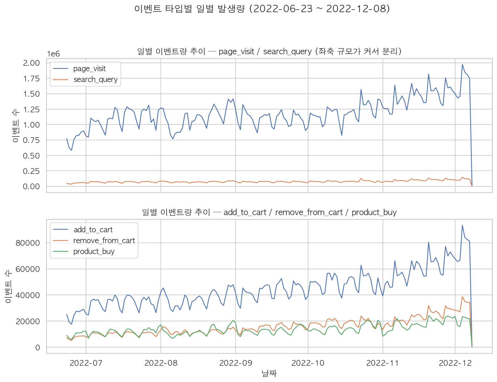 | 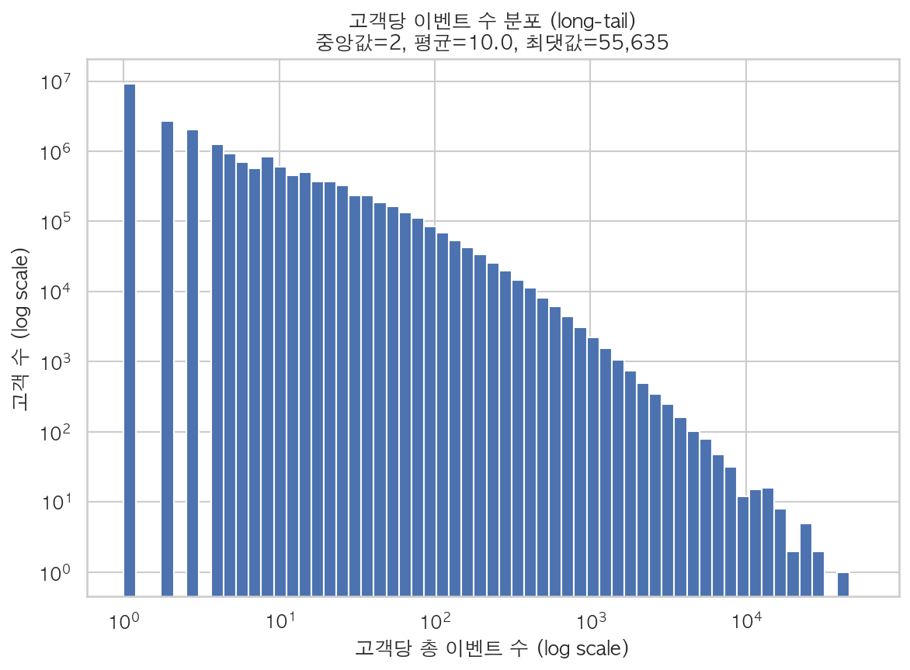 |
| 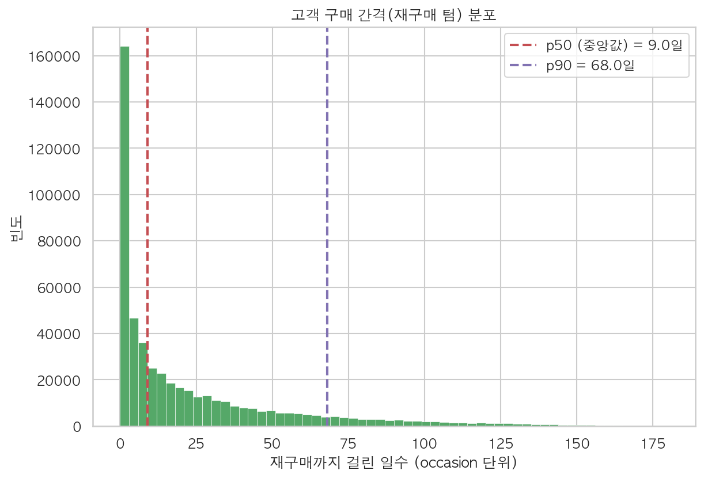 | 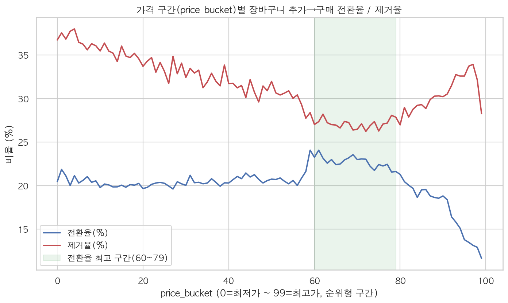 |

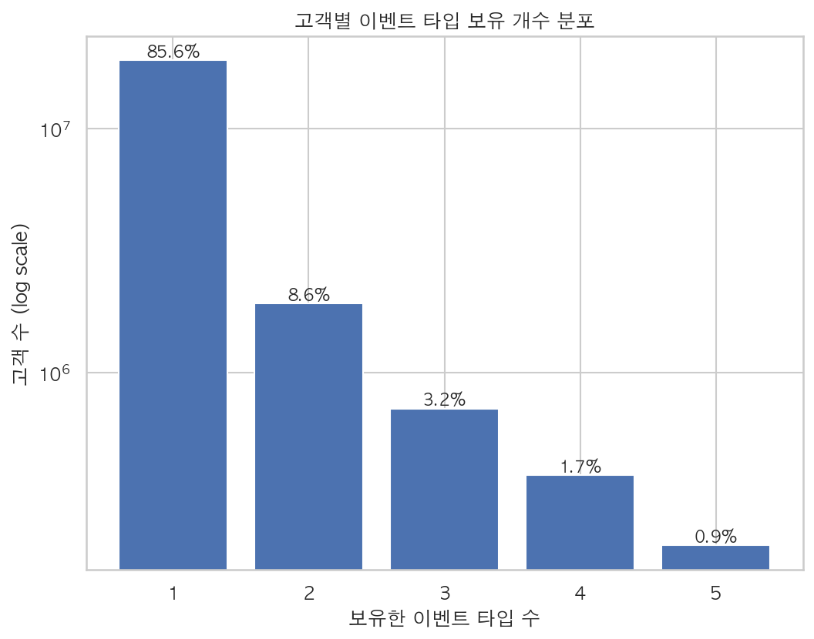

가격구간(price_bucket)별 전환율은 선형이 아니라 **굴곡형**이다. 60~79
구간에서 전환율이 가장 높고(23%대), 제거율은 가장 낮다(27%대). 가격
저항이 뚜렷하게 나타나는 건 최상위 90~99 구간뿐이다 — 여기서 전환율이
11.6%까지 뚝 떨어진다.

### 퍼널 · 코호트 · 라이프사이클 · 세그먼트

- **퍼널**: 탐색 98.66% → 장바구니 10.40% → 구매 2.59% (고객 단위, 상품
  단위는 불가능)
- **코호트/리텐션**: 첫 관측 구매 주차 기준 25개 코호트, 7일 재구매율
  ~10.9%, 14일 ~13.9%, 28일 ~18.1% (검열된 최근 코호트 제외)
- **라이프사이클**: 데이터 기반 recency 임계값(14/28/60일, 구매 간격
  중앙값·p90의 배수로 산출)으로 8개 상태 분류
- **세그먼트**: 규칙 기반 9개(군집분석 미사용), CRM 목적·추천 액션·접촉
  우선순위·과접촉 위험 포함

| | |
|---|---|
| 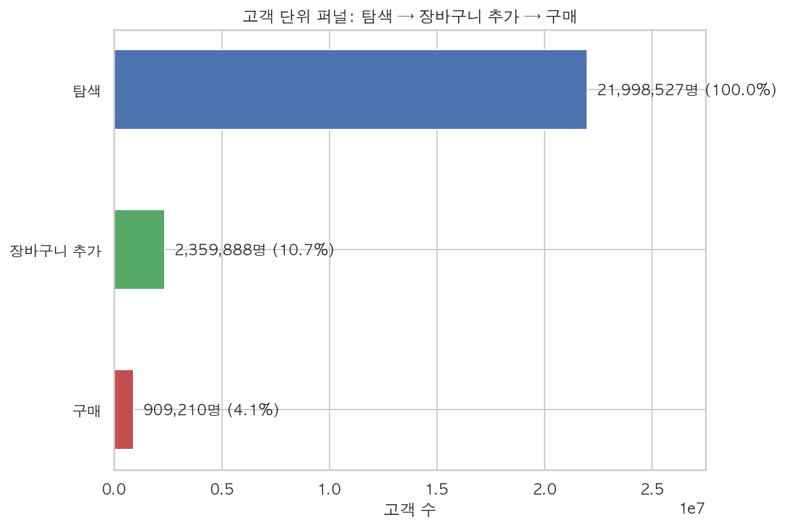 | 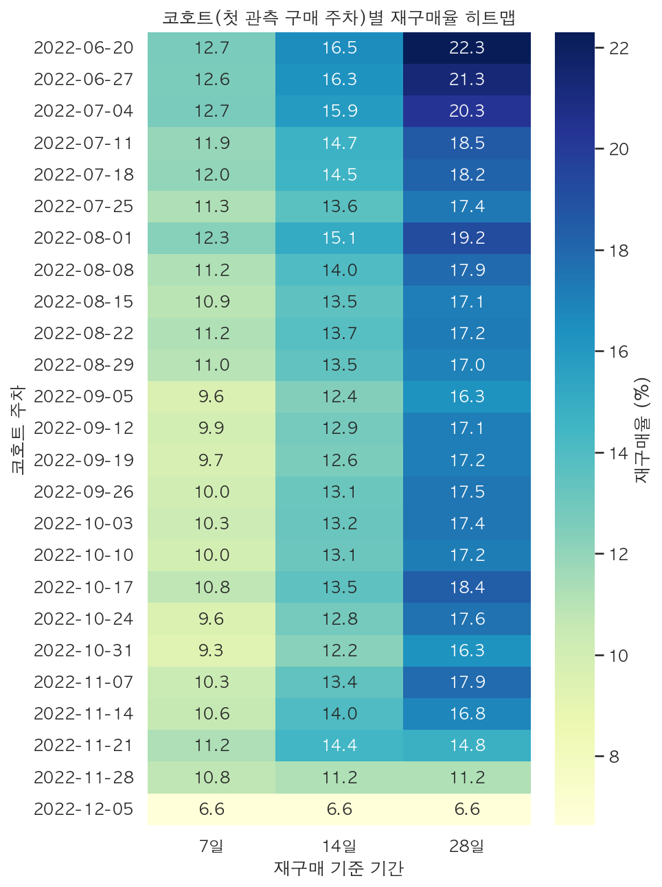 |
| 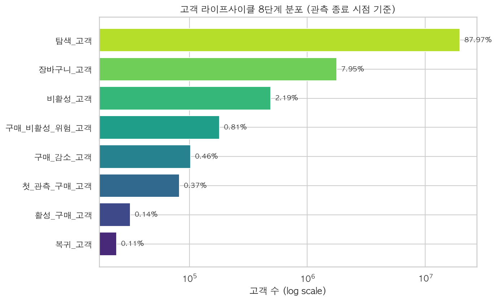 | 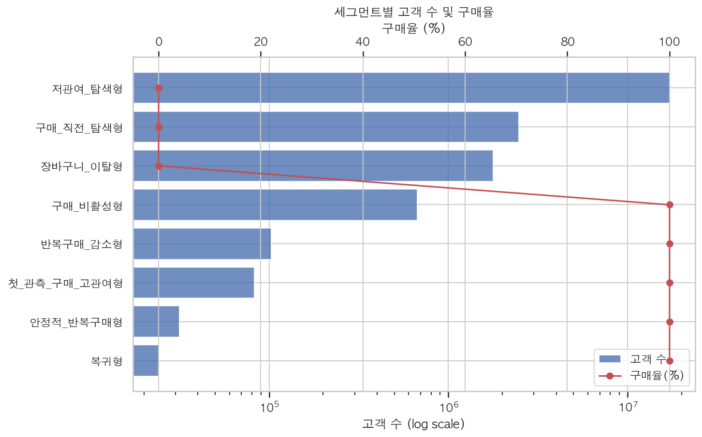 |

코호트 히트맵의 마지막 3~4개 행(2022-11-14 이후)은 우측 검열로 값이
실제보다 낮게 나타난다 — "3. 데이터 한계" 참고.

상세: [`reports/phase3_funnel_analysis.md`](reports/phase3_funnel_analysis.md),
[`reports/phase4_lifecycle_analysis.md`](reports/phase4_lifecycle_analysis.md),
[`reports/phase4_segment_profile.md`](reports/phase4_segment_profile.md)

## 7. 모델링

모델은 두 개다. 각각 14일/28일짜리 라벨로 비교했고, 시간순으로
Train 6개·Val 1개·Test 2개 스냅샷으로 나눴다.

| 모델 | 목적 | 모집단 | LightGBM AUC (test) | 최선 규칙 대비 |
|---|---|---|---:|---|
| Model A (구매 비활성) | 14/28일 내 미구매 예측 | 구매 이력 고객 | 0.754 / 0.742 | 규칙(최근성, 0.669)보다 우수 |
| Model B (구매성향) | 14/28일 내 구매 예측 | 활동 고객(비구매자 포함) | 0.865 / 0.858 | 규칙(최근성, 0.804)보다 우수 |

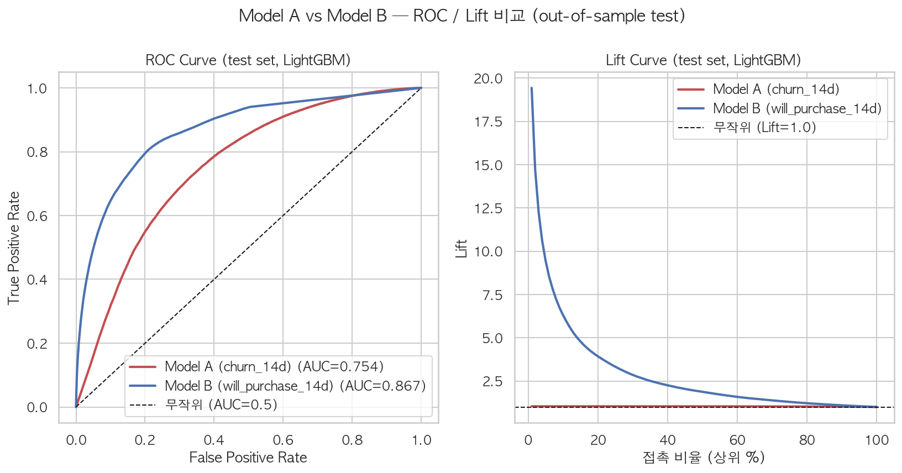

Lift curve를 보면 두 모델의 실무적 차이가 그대로 드러난다. Model A는
전 구간에서 Lift가 1.0 근처에 눌려 있다 — 라벨 기저율이 이미 90%가
넘어서다. Model B는 다르다. 상위 1%에서 Lift가 18.9배까지 치솟는다.

무작위·전체평균·최근성·빈도·라이프사이클 규칙과도 비교했다. 상세:
[`reports/phase6_modeling_results.md`](reports/phase6_modeling_results.md),
모델 카드: [`reports/model_cards/`](reports/model_cards/)

## 8. 타기팅 시뮬레이션

테스트셋(out-of-sample)에서, 최근성 규칙과 똑같은 Recall을 달성하려면
접촉 인원을 얼마나 줄일 수 있는지 봤다:

| 모델 | 절감률 (5~30% 접촉 구간) |
|---|---|
| Model A (구매 비활성) | 0.58% ~ 1.64% (제한적) |
| Model B (구매성향) | 19.59% ~ 50.87% (뚜렷함) |

> 모델로 상위 10% 고객을 뽑으면, 최근성 규칙과 같은 포착률(Recall)을
> 21.68% 더 적은 인원으로 달성한다 (Model B, will_purchase_14d).

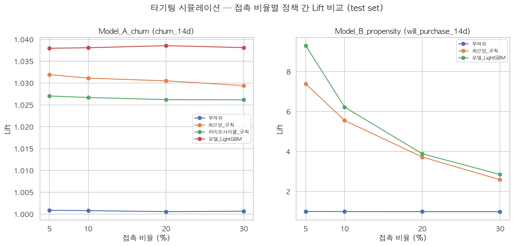

**왜 두 모델의 차이가 이렇게 큰가**: Lift는 라벨의 기저율에 상한이 묶여
있다. Model A의 라벨(90%+가 "비활성")은 이미 다수 클래스라 개선 여지가
작다. Model B의 라벨(1~7%가 "구매함")은 소수 클래스다. 그래서 모델이
순위를 잘 매기면 그게 그대로 실무 효율로 이어진다. 상세:
[`reports/phase7_targeting_simulation.md`](reports/phase7_targeting_simulation.md)

## 9. 대시보드

Streamlit으로 7개 페이지를 만들었다: Overview, Funnel, Cohort & Retention,
Lifecycle, Segment Explorer, Targeting Simulator, AI CRM Report.

```bash
python3 scripts/build_dashboard_data.py
streamlit run app/Home.py
```

모든 페이지에 데이터 관측 기간(2022년 6~12월)을 표시한다. 우측 검열로
왜곡될 수 있는 지표(비활성 고객 수, 최근 코호트 재구매율)에는 별도로
경고도 띄운다.

| Overview | Lifecycle |
|---|---|
| 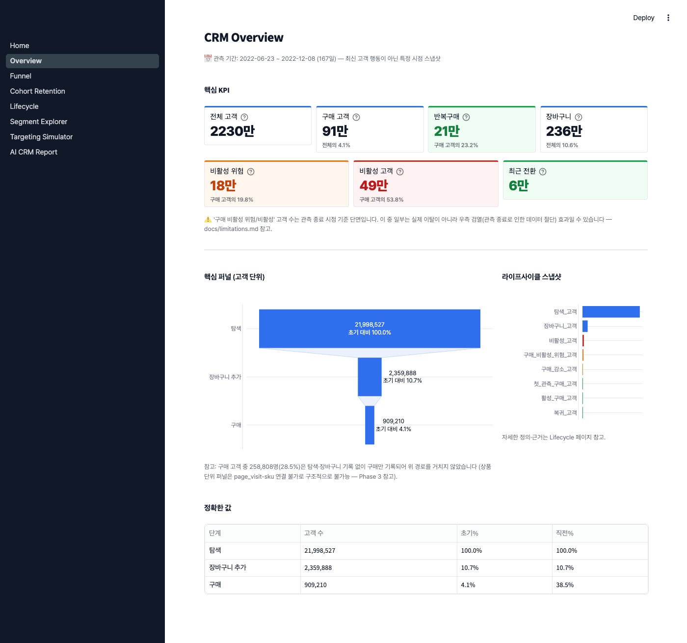 | 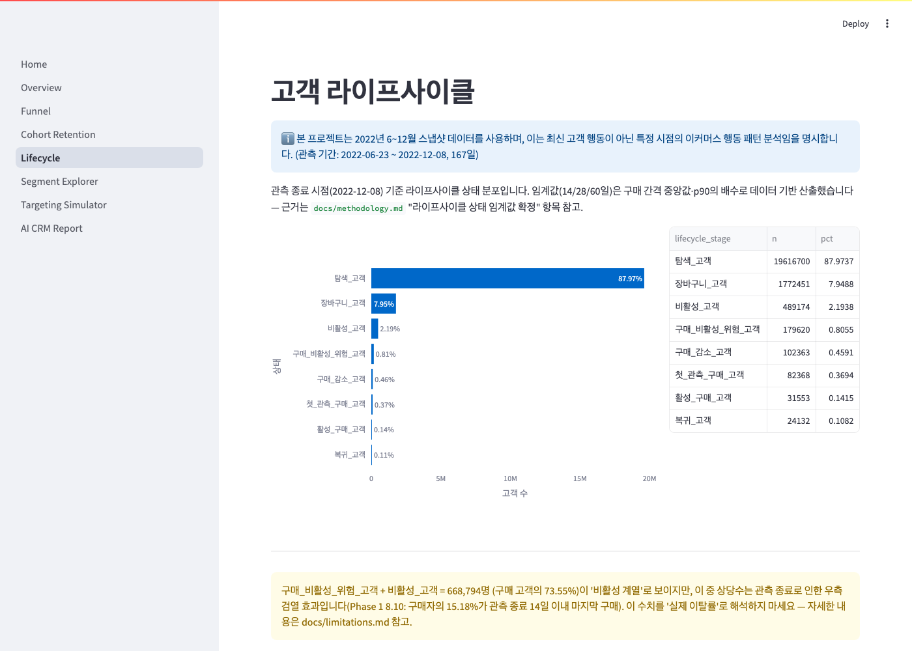 |

| Segment Explorer | Targeting Simulator |
|---|---|
| 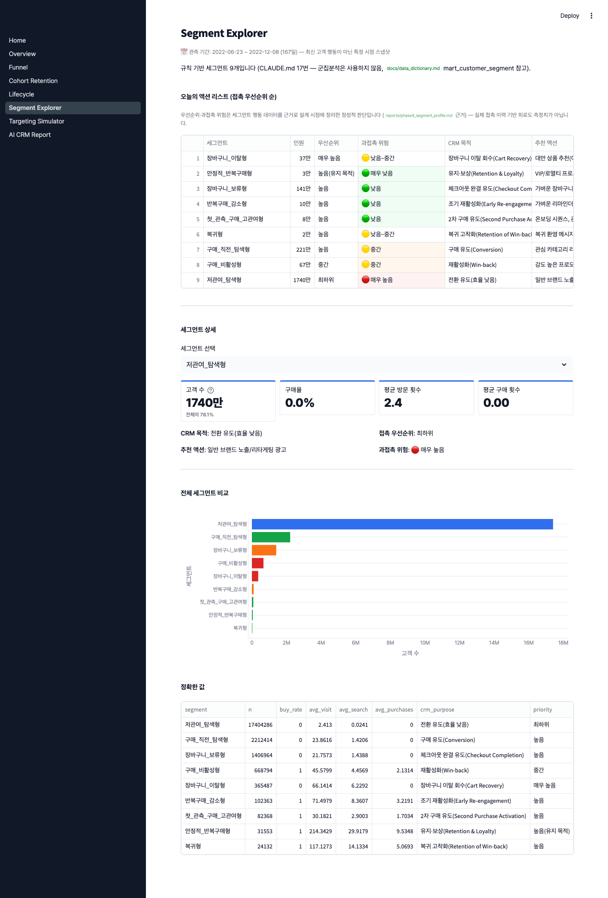 | 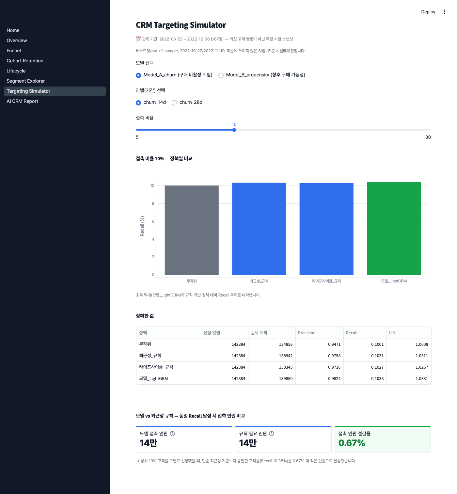 |

## 10. LLM 리포트

```
DuckDB SQL → Python 검증 → Pydantic JSON → LLM → CRM 리포트
```

LLM은 숫자를 계산하지 않는다. Data Facts와 Model Predictions는 Python이
계산한 값을 그대로 통과시킨다. LLM이 만드는 건 Recommended Actions와
Testable Hypotheses, 이 두 가지뿐이다. 출력에 "매출 개선" 같은 금지된
성과 표현이 나오면, 리포트 생성 자체를 예외로 중단시킨다.

API 키가 없으면 mock(결정론적 대체) 백엔드로 돌아간다. `.env`에
`ANTHROPIC_API_KEY`나 `OPENAI_API_KEY`를 넣으면, 코드를 안 건드려도
실제 LLM 호출로 바뀐다. 상세: [`reports/phase9_llm_report_pipeline.md`](reports/phase9_llm_report_pipeline.md)

## 11. 핵심 결과

- 최근성 규칙과 똑같은 포착률(Recall)을 내려면, 모델은 접촉 인원을
  **최대 50.87% 덜 써도 된다** (Model B, will_purchase_14d, 30% 접촉 구간)
- 구매 비활성 위험 예측은 AUC 기준으로 규칙보다 낫다(0.754 vs 0.669).
  다만 라벨 기저율이 이미 90%가 넘어서, 실무적인 접촉 절감 효과는 크지 않다
- 라이프사이클 임계값(14/28/60일)은 임의로 정하지 않았다. 실제 구매
  간격 분포(중앙값 9.48일, p90 68.05일)에서 데이터 기반으로 뽑아낸 값이다
- 우측 검열은 스냅샷 설계 단계에서 원천 차단했다. 검열을 보정하지 않으면
  "최근 코호트일수록 지표가 급락하는" 착시가 생기는데, 이 문제를 없앴다

## 12. 한계

전체 목록은 [`docs/limitations.md`](docs/limitations.md)에 있다. 핵심만
보려면 위 "3. 데이터 한계"를 보면 된다.

## 13. 실제 운영 시 실험 설계 (제안, 미실행)

이 프로젝트는 실제 캠페인을 집행하지 않았다. 운영 적용을 고려한다면:

- **A/B 테스트**: 같은 접촉 예산으로 두 그룹을 나눈다 — (A) 최근성
  규칙으로 뽑은 그룹, (B) 모델로 뽑은 그룹. 실제 반응률(재구매·전환)을
  비교한다
- **Model B 우선 검증**: 시뮬레이션에서 개선 폭이 컸던 건 구매성향
  모델(Model B)이다. 실제 실험도 여기부터 시작하는 게 맞다
- **재활성화 캠페인은 비용 대비 효과부터**: Model A는 시뮬레이션상
  개선 폭이 작았다. 그러니 실제 win-back 성공률이 규칙 기반과 통계적으로
  유의미하게 다른지부터 확인해야 한다
- **장기 관찰도 필요하다**: 6개월치 스냅샷만으론 한계가 있다. 최소
  12개월 이상 데이터로 다시 검증해보길 권한다

## 14. 실행 방법

상세 절차: [`docs/deployment.md`](docs/deployment.md)

```bash
python3 -m venv .venv && source .venv/bin/activate
pip install -r requirements.txt

# 원본 데이터를 data/raw/synerise_dataset/에 위치시킨 후
python3 scripts/build_database.py
python3 scripts/train_model_a.py && python3 scripts/train_model_b.py
python3 scripts/build_targeting_simulation.py
python3 scripts/build_dashboard_data.py
streamlit run app/Home.py

pytest tests/ -q   # 125개 데이터 품질/모델/파이프라인 테스트
```

## 기술 스택

Python 3 · DuckDB · SQL · Parquet · pandas · scikit-learn · LightGBM ·
pytest · Streamlit · Plotly · Pydantic · (선택) Anthropic/OpenAI API

## 라이선스

코드: [MIT License](LICENSE). 데이터: CC BY-NC 4.0 (Synerise SA, 원본
미포함 — "2. 데이터 출처" 참고).
