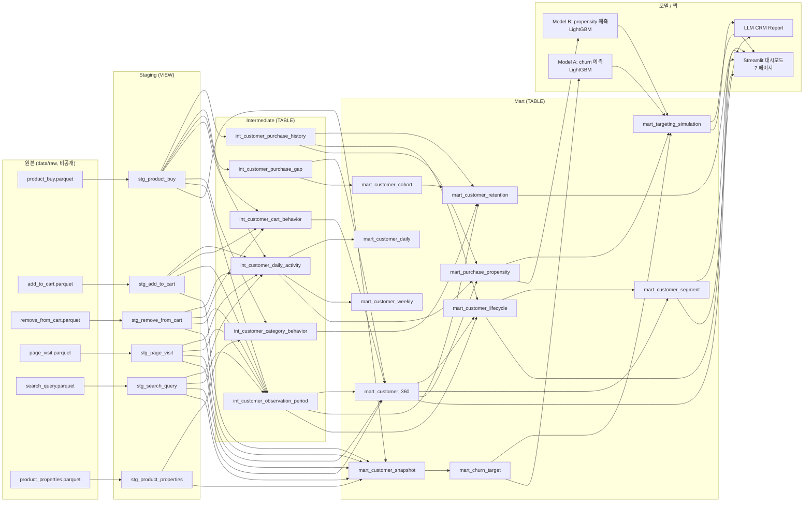

# ERD / 데이터 계보 (Data Lineage)

전통적인 FK 제약 기반 ERD보다, 이 프로젝트는 **staging → intermediate → mart**
순서로 흐르는 파이프라인 구조가 더 정확하게 관계를 보여준다. 각 화살표는
"입력으로 사용됨"을 의미한다. 상세 Grain/PK/컬럼 정의는 `docs/data_dictionary.md`
참고.

## 레이어 요약

| 레이어 | 저장 방식 | 개수 | 설명 |
|---|---|---:|---|
| staging | VIEW | 6 | 원본 Parquet lazy 참조, 타입 캐스팅 + 버스트 플래그만 추가 |
| intermediate | TABLE | 6 | 고객 단위 집계·enrichment |
| mart | TABLE | 11 | 분석/모델링/대시보드가 직접 소비하는 최종 테이블 |

## Grain 빠른 참조

| 테이블 | Grain |
|---|---|
| mart_customer_360 | client_id |
| mart_customer_cohort | client_id (구매자만) |
| mart_customer_retention | cohort_week |
| mart_customer_daily | client_id × activity_date |
| mart_customer_weekly | client_id × week_start |
| mart_customer_lifecycle | client_id |
| mart_customer_segment | client_id |
| mart_customer_snapshot | client_id × snapshot_date |
| mart_churn_target | client_id × snapshot_date |
| mart_purchase_propensity | client_id × snapshot_date |
| mart_targeting_simulation | model × label × contact_rate_pct × policy |

전체 컬럼 정의·생성 SQL·품질 테스트는 `docs/data_dictionary.md` 참고.
